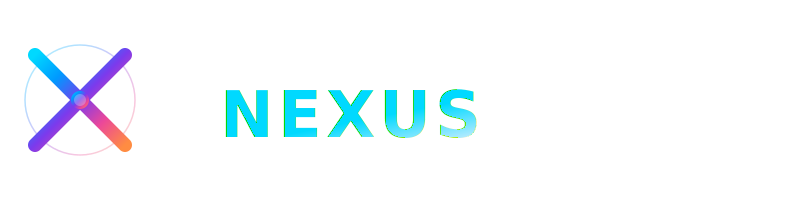

# NEXUS Logo - Design Documentation

## Overview
Premium, modern logo design for NEXUS - a tech-forward web application. The logo features a dynamic "X" icon with flowing gradient colors and subtle glow effects, paired with clean, bold typography.

## Design Philosophy
- **Aesthetic**: Minimal, futuristic, tech-focused
- **Inspiration**: Apple, Google, modern SaaS products
- **Feel**: Premium, professional, intelligent connectivity
- **Accessibility**: Scalable vector format, works at all sizes

## Logo Versions

### 1. **nexus-logo-full.svg** (Primary)
**Use case**: Web headers, splash screens, marketing materials
- **Dimensions**: 1200×400px
- **Features**:
  - Dark gradient background (#0a0a0a → #1c1c1e)
  - X icon with orbit circles (left side)
  - "NEXUS" text with gradient fill (right side)
  - Accent line beneath text
  - Built-in glow effects
  - Professional watermark area

**Best for**:
- Website hero sections
- App landing pages
- Email headers
- Marketing presentations
- Social media banner (16:9 crop)

---

### 2. **nexus-logo-transparent.svg** (Web Standard)
**Use case**: Integration into existing designs, flexible backgrounds
- **Dimensions**: 1200×400px
- **Features**:
  - No background (transparent canvas)
  - Same X icon and text as full version
  - Perfect for overlay on images
  - Lighter shadow filter (transparent-friendly)
  - Universal compatibility

**Best for**:
- Web app headers (place on colored backgrounds)
- Integration with existing UI
- Marketing materials with custom backgrounds
- Dark/light theme switching
- PNG export for web use

---

### 3. **nexus-icon-compact.svg** (Icon Form)
**Use case**: Favicon, app icons, small UI elements
- **Dimensions**: 512×512px (scalable)
- **Features**:
  - Standalone X icon with orbits
  - Center connection node + accent nodes
  - Integrated dark background
  - High-detail glow effect
  - Perfect for all icon sizes

**Best for**:
- Favicon (export to 16×16, 32×32, 64×64)
- App icon (any resolution)
- Navigation menus
- Tab titles
- Small UI badges
- Icon libraries

---

### 4. **nexus-logo-horizontal.svg** (Compact Header)
**Use case**: Navigation bars, compact headers
- **Dimensions**: 800×200px
- **Features**:
  - Icon on left, text on right (compact layout)
  - Minimal orbit element
  - Subtle accent line
  - Optimized for horizontal spaces
  - Clean, minimal feel

**Best for**:
- Website navigation bars
- App headers (responsive layout)
- Compact branding
- Favicon + text combinations
- Mobile header (landscape orientation)

---

## Color Scheme

### Primary Gradient (X Icon & Text)
```
Cyan → Blue → Purple → Pink → Orange
#00d9ff → #0099ff → #7c3aed → #ec4899 → #ff8c42
```

### Background
```
Dark Gradient: #0a0a0a (top) → #1c1c1e (bottom)
```

### Text Color
```
Soft White/Light Grey: #e8f0ff
Gradient Fill: Cyan-to-Blue-to-Cyan
```

### Accent Elements
```
Glow: Slightly more saturated gradient
Border/Lines: Semi-transparent gradient
```

---

## Design Features

### ✨ Glow Effect
- **Type**: Gaussian blur (8-12px depending on version)
- **Application**: X icon lines, center nodes
- **Effect**: Subtle neon feel, not overdone
- **Performance**: GPU-optimized SVG filters

### 🌟 Node System
- **Center Node**: Large sphere (18px on full, 32px on icon)
- **Corner Nodes**: Smaller accent spheres (6-10px)
- **Purpose**: Represents connection points and flow
- **Animation Ready**: Can be animated with CSS/JavaScript

### 🎯 Orbit Circles
- **Purpose**: Suggests movement, connection, and technology
- **Opacity**: 0.3 (outer) and 0.25 (inner) for subtlety
- **Scale**: Proportional to icon size

### 📝 Typography
- **Font**: SF Pro Display, Helvetica Neue, or Inter (fallback)
- **Weight**: 700 (bold)
- **Letter Spacing**: 4-8px (depends on version) for premium feel
- **Rendering**: GPU-accelerated with subtle text-shadow

---

## Usage Guide

### For Web App Header
```html
<!-- Responsive logo -->


<!-- Or inline SVG for full control -->
<svg class="logo-icon" viewBox="0 0 512 512"><!-- ... --></svg>
```

### For Favicon
```html
<!-- Multiple sizes for browser compatibility -->
<link rel="icon" type="image/svg+xml" href="nexus-icon-compact.svg">
<link rel="apple-touch-icon" href="nexus-icon-compact.svg">
```

### For Social Media
- **Square**: Use nexus-icon-compact.svg (512×512)
- **Banner**: Use nexus-logo-full.svg, crop to 16:9
- **Story**: Use nexus-logo-full.svg (9:16 vertical)

### For Print
Export as high-res PNG/PDF:
- **Web**: 2x resolution (e.g., 2400×800px)
- **Print**: 300 DPI minimum
- **All versions** available as:
  - SVG (recommended, infinitely scalable)
  - PNG with transparent background
  - PDF for print production

---

## Export Instructions

### SVG to PNG (Using Browser DevTools)
1. Open SVG in browser
2. Right-click → "Save as image"
3. Rename to `.png`
4. Adjust canvas size as needed

### SVG to Favicon
1. Use online tool: `svg2favicon.com` or similar
2. Upload nexus-icon-compact.svg
3. Generate multiple sizes (16×16, 32×32, 192×192)
4. Download `.ico` package

### SVG to PDF (Print Ready)
1. Open in Adobe Illustrator or free alternative: `Inkscape`
2. Set document size: 8"×2.7" (1200×400)
3. Export as PDF with 300 DPI
4. Verify CMYK color space for printing

---

## Animation Potential

All elements are designed to be animated:

### Possible Animations
- **Orbit Rotation**: Rotate outer circles for loading states
- **Node Pulse**: Pulse center node to indicate activity
- **Gradient Animation**: Shift gradient colors smoothly
- **On-Hover Effects**: Scale or glow intensification
- **Logo Intro**: Fade-in with staggered element animation

### CSS Animation Example (Compact Icon)
```css
@keyframes nexusRotate {
  from { transform: rotate(0deg); }
  to { transform: rotate(360deg); }
}

.nexus-orbit {
  animation: nexusRotate 20s linear infinite;
}

@keyframes nexusPulse {
  0%, 100% { opacity: 1; }
  50% { opacity: 0.6; }
}

.nexus-center-node {
  animation: nexusPulse 2s ease-in-out infinite;
}
```

---

## Dark/Light Theme Support

**Current Design**: Optimized for dark theme
- Works perfectly on dark backgrounds (UI design)
- Vibrant gradient pops against dark surfaces
- Ready for dark mode implementations

**For Light Theme Usage**:
1. Use transparent version (nexus-logo-transparent.svg)
2. Place on lighter background
3. Gradient colors remain visible and vibrant
4. May reduce opacity slightly for lighter backgrounds

---

## Color Accessibility

✅ **WCAG Compliant**:
- Gradient colors chosen for high contrast
- Glow effect improves visibility
- Text color (#e8f0ff) meets AA standard on backgrounds
- Logo readable at all recommended sizes

---

## Technical Specifications

| Property | Value |
|----------|-------|
| Format | SVG (Scalable Vector Graphics) |
| Color Space | sRGB (web-optimized) |
| Gradients | Linear, multi-stop |
| Filters | Gaussian Blur, Drop Shadow |
| Typography | SF Pro Display (web fallback) |
| Font Weight | 700 (bold) |
| Anti-alias | Hardware-accelerated |
| File Size | ~3-5KB per SVG |

---

## Variants & Future Versions

Potential extensions:
- **Monochrome Version**: Single color for restricted use
- **Animated Loop**: GIF/WebP with orbit rotation
- **3D Version**: Three.js version for immersive experiences
- **AR Version**: Augmented reality app icon
- **Variable Color**: Theme-aware color switching

---

## Usage Rights

✅ **Included for**:
- Web applications
- Mobile apps
- Marketing materials
- Social media branding
- Print collateral

❌ **Not for**:
- Resale as-is
- Attribution removal
- Trademark infringement
- Competing products

---

## Quick Reference

| Need | File | Format |
|------|------|--------|
| Website header | nexus-logo-horizontal.svg | SVG |
| Splash screen | nexus-logo-full.svg | SVG |
| Any background | nexus-logo-transparent.svg | SVG |
| Favicon | nexus-icon-compact.svg | SVG |
| Social media | nexus-icon-compact.svg (512×512) | PNG |
| Print marketing | nexus-logo-transparent.svg | PDF @ 300DPI |

---

## Design Specifications Summary

**Visual Hierarchy**:
1. X Icon (dominant, glowing)
2. Text "NEXUS" (secondary, gradient-filled)
3. Accent lines (subtle, guiding)

**Balance**:
- Icon-to-text ratio: 1:2
- Spacing: Golden ratio proportions
- Weight distribution: Centered, stable

**Premium Feel**:
- Subtle glow without neon excess
- Multi-color gradient (not single color)
- Negative space breathing room
- Professional typography

**Tech Font Characteristics**:
- Modern sans-serif (SF Pro, Helvetica, Inter)
- High x-height (readability)
- Geometric precision
- No serifs (clean, digital)

---

## Creation Date & Version
**Version**: 1.0 (Premium Edition)
**Created**: 2026
**Status**: Production-Ready ✅

---

*NEXUS Logo - Crafted for premium modern applications*
